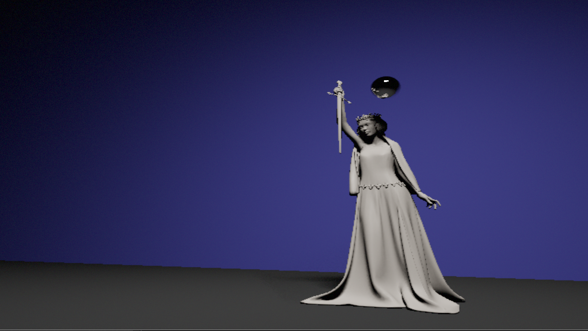

This is a simple whitted style ray tracer running mostly on the CPU.
It (kind of) runs in real-time.
I don't recommend anyone to use this as a serious reference.
One major bug is currently present: SSAA does not work properly.

You can follow me on Twitter where I will show more cool things soon(tm).
https://twitter.com/falk_moritz
